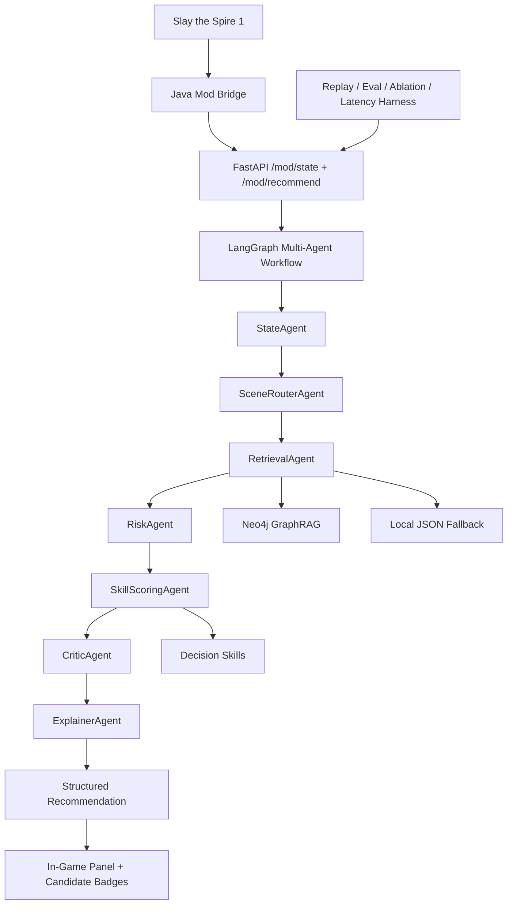

# Slay the Spire Mod-First Multi-Agent Decision Harness

A **real-time in-game AI decision assistant** for **Slay the Spire 1**. The game is the domain, but the project is designed as an AI application engineering showcase: Mod-first UX, LangGraph multi-agent workflow, pluggable Decision Skills, GraphRAG retrieval, deterministic scoring, replay harness, ablation harness, latency metrics, and Chinese/English in-game presentation.

The current product direction is not a webpage companion. The core experience is a native ModTheSpire/BaseMod bridge that shows recommendations directly inside the game.

## What It Demonstrates

- **Mod-first realtime AI product**: Java Mod reads game state and renders recommendations in-game.
- **Multi-Agent workflow**: LangGraph routes state through State, Router, Retrieval, Risk, Skill Scoring, Critic, and Explainer agents.
- **Decision Skill system**: Card pick, relic pick, shop, pathing, combat, and rest-site skills share one contract but can evolve independently.
- **GraphRAG + scoring**: Neo4j-first graph retrieval with local JSON fallback, then structured scoring instead of direct LLM guessing.
- **Replay/eval harness**: fixed eval cases, real Mod payload replay, ablation switches, latency percentiles, and tuning flags.
- **Game-facing UX**: F8/F9/F10/F11 controls, candidate score badges, hover details, target archetype selection, and Chinese display.

## Current Metrics

From the current local benchmark and harness:

| Area | Current Snapshot |
| --- | ---: |
| Graph entities | 666 |
| Graph relationships | 1442 |
| Cards / relics / potions | 367 / 146 / 42 |
| Enemy entries | 57 |
| Mechanics / shop actions / path nodes | 35 / 5 / 7 |
| Tracked archetypes | 20 |
| Seeded archetype rule coverage | 100% |
| Fixed eval cases | 54 |
| Eval Top-1 / Top-3 | 1.0 / 1.0 |
| Harness P95 latency | about 2-3 ms locally |
| Naive base-value baseline Top-1 / Top-3 | 0.593 / 0.759 |
| No-strategy ablation Top-1 / Top-3 | 0.87 / 1.0 |
| Agent trace audit | 6/6 complete traces |
| Chinese localization coverage | 560/612 entities, 91.5% |
| Relationships missing provenance | 0 |

The eval set is still intentionally small and curated. The next quality milestone is to expand it with real-game captured payloads and human-labeled high-level decisions.

## Architecture



## In-Game Mod Features

The Java bridge lives in `mod-bridge` and posts live game snapshots to the local API.

Current controls:

| Key | Action |
| --- | --- |
| F8 | Show/hide recommendation panel |
| F9 | Show/hide debug panel |
| F10 | Toggle English/Chinese display |
| F11 | Cycle target archetype for the current character |

Current in-game surfaces:

- Compact top-right recommendation panel.
- Candidate score badges for card rewards, relic rewards, Boss relics, and shop options.
- Hover details for individual candidates: score, confidence, reasons, risks, shop price, affordability.
- Target archetype display, for example `Silent Poison` / `猎手毒流`.
- Debug visibility for selected skill, scene, request status, badge matching, shop context, and target archetype.

Map recommendation from the Java Mod is currently kept conservative because the earlier live map capture path was unstable. The backend pathing skill and fixtures still exist for harness testing.

## Decision Skills

`sts_engine/skills` exposes pluggable skills:

- `CardPickSkill`
- `RelicPickSkill`
- `ShopSkill`
- `PathingSkill`
- `CombatSkill`
- `RestSiteSkill`

Each skill follows the same high-level contract: build options, retrieve context, score options, explain, and validate. This lets the project tell a concrete "Skill implementation" story in interviews instead of presenting one monolithic scoring function.

## Multi-Agent Workflow

`sts_engine/agent.py` uses LangGraph when available, with a sequential fallback for dependency-light execution.

Agents:

- `StateAgent`: validates run id, character, query type, and scene.
- `SceneRouterAgent`: selects the right Decision Skill.
- `RetrievalAgent`: retrieves graph and strategy context.
- `RiskAgent`: detects missing AoE, low defense, low HP, slow scaling, and shop readiness.
- `SkillScoringAgent`: calls the selected skill.
- `CriticAgent`: checks empty options, scene/query mismatches, and invalid recommendations.
- `ExplainerAgent`: returns structured reasons, risks, score breakdown, and candidate comparisons.

Runtime recommendations are deterministic and do not require external LLM calls. LLMs can be added later for offline strategy summarization or richer natural-language explanations, but the real-time core stays cheap and low-latency.

## Knowledge and Strategy Layer

Main data:

```text
data/public_full_data.json
data/strategy/archetypes.json
data/strategy/community_rules.json
data/localization_zhs.json
```

The project uses stable English ids internally; Chinese and English names are presentation fields.

The strategy layer currently tracks 20 seeded archetypes:

- Silent: Poison, Shiv, Discard, Wraith Form / Apparition Defense, Grand Finale / Deck Control
- Ironclad: Strength, Exhaust / Corruption, Barricade Block, Self Damage, Searing Blow
- Defect: Frost Focus, Lightning / Electrodynamics, Dark Orb, Power / Creative AI, Claw / Zero Cost
- Watcher: Stance Dance, Wrath Burst, Divinity / Mantra, Retain, Pressure Points

Run coverage inventory:

```powershell
python scripts\strategy_coverage_report.py
```

## Harness and Evaluation

The unified harness is the most resume-relevant part after the Mod bridge:

```powershell
python scripts\decision_harness.py --mode all --no-write --summary-only
```

It covers:

- Eval Harness: Top-1/Top-3 on fixed cases.
- Replay Harness: replays real Java Mod JSONL payloads.
- Ablation Harness: disables graph, strategy, risk, or critic components.
- Latency Harness: P50/P95/P99 recommendation latency.

Interview-ready reports:

```powershell
python scripts\ablation_insights.py
python scripts\agent_trace_audit.py
```

Generated reports:

- `reports/ablation_insights.md`: compares input-order and base-value baselines against the full system and module ablations.
- `reports/agent_trace_audit.md`: expands representative cases into State/Router/Retrieval/Risk/Scoring/Critic/Explainer traces.

Real Mod payload replay:

```powershell
python scripts\replay_mod_payloads.py data\mod_payload_replay_sample.jsonl
```

Replay output includes tuning fields:

- target archetype
- candidate options
- Top vs runner-up score gap
- score spread
- skip rank
- top reasons and risks
- per-option score summaries
- quality flags such as `low_top_separation`

This makes live-game errors reproducible and lets recommendation quality improve through evidence instead of guesswork.

## Quick Start

Use Python 3.11 or 3.12 on Windows.

```powershell
py -3.11 -m venv .venv
.\.venv\Scripts\Activate.ps1
python -m pip install --upgrade pip
python -m pip install -r requirements.txt
powershell -ExecutionPolicy Bypass -File scripts\dev_check.ps1
powershell -ExecutionPolicy Bypass -File scripts\run_api.ps1
```

Open:

```text
http://127.0.0.1:8000
```

The webpage is mainly a debug/demo surface. The core product is the in-game Mod.

## Build and Install the Mod Bridge

The build script uses local Slay the Spire, ModTheSpire, and BaseMod jars.

```powershell
powershell -ExecutionPolicy Bypass -File scripts\build_mod_bridge.ps1
```

This project is configured locally to copy the latest JAR to:

```text
E:\SteamLibrary\steamapps\common\SlayTheSpire\mods\sts-agent-bridge-0.1.0.jar
```

You can override the target with `STS_AGENT_MODS_DIR` or `mod-bridge/local.modsdir.txt`.

Useful runtime options:

```powershell
$env:STS_AGENT_API_URL="http://127.0.0.1:8000"
$env:STS_AGENT_CAPTURE="true"
$env:STS_AGENT_ARCHETYPE="silent_poison"
```

Captured payloads are written as JSONL and can be replayed:

```powershell
python scripts\replay_mod_payloads.py artifacts\mod_payloads\<capture-file>.jsonl
```

## Neo4j

Neo4j is optional for local demos because the project has a local JSON fallback. To ingest the graph:

```powershell
$env:NEO4J_URI="bolt://localhost:7687"
$env:NEO4J_USER="neo4j"
$env:NEO4J_PASSWORD="your_password"
python scripts\ingest_graph.py --data data\public_full_data.json --dry-run
python scripts\ingest_graph.py --data data\public_full_data.json
```

The ingestion preserves provenance fields such as source, source URL, confidence, source entity id, and target entity id.

## Important Files

```text
api/main.py                         FastAPI app and Mod endpoints
sts_engine/agent.py                 LangGraph multi-agent workflow
sts_engine/skills/                  Pluggable Decision Skills
sts_engine/scoring.py               Deterministic scoring and risk adjustment
sts_engine/knowledge_base.py        Entity, strategy, and local graph lookup
sts_engine/retriever.py             Neo4j-first GraphRAG retriever
mod-bridge/                         ModTheSpire/BaseMod Java bridge
scripts/decision_harness.py         Eval/replay/ablation/latency harness
scripts/ablation_insights.py        Baseline and ablation insight report
scripts/agent_trace_audit.py        Representative Multi-Agent trace report
scripts/replay_mod_payloads.py      Real Mod payload replay
scripts/replay_analysis.py          Replay tuning analysis
reports/benchmark.md                Generated benchmark snapshot
reports/ablation_insights.md        Baseline vs full-system comparison
reports/agent_trace_audit.md        Agent trace audit examples
docs/resume_project_summary.md      Resume-ready project writeup
docs/ai_app_and_pm_polish_plan.md   AI application / AI PM polish plan
docs/project_implementation_report.md Implementation report and interview story
docs/product_prd.md                 Product requirements document
docs/user_journey.md                User journey and in-game UX design
docs/competitor_analysis.md         Companion/overlay competitor analysis
docs/feature_priority_matrix.md     Value/cost/risk feature prioritization
docs/product_metrics.md             Product metrics and evaluation loop
```

## Verification

Full local check:

```powershell
powershell -ExecutionPolicy Bypass -File scripts\dev_check.ps1
```

The check validates Python dependencies, API import, data integrity, localization, community rules, Neo4j dry-run ingestion, graph fixtures, decision engine invariants, replay analysis, live bridge scenarios, replay fixture, unified harness, and benchmark generation.

## Resume Framing

Suggested one-line resume description:

> Built a Mod-first Multi-Agent Decision Harness for Slay the Spire, combining LangGraph agents, pluggable decision skills, Neo4j/JSON GraphRAG retrieval, deterministic scoring, in-game Java Mod overlays, real payload replay, ablation testing, and latency/evaluation reporting.

Suggested bullets:

- Built a realtime in-game decision assistant with ModTheSpire/BaseMod, FastAPI, WebSocket sync, candidate score badges, hover explanations, Chinese/English UI, and target-archetype controls.
- Designed a LangGraph multi-agent workflow with State, Router, Retrieval, Risk, Skill Scoring, Critic, and Explainer agents; exposed `agent_trace`, `selected_skill`, and critic warnings for debugging.
- Modeled 666 entities and 1442 provenance-tracked relationships from public Slay the Spire data; supported Neo4j GraphRAG with local JSON fallback.
- Implemented 6 pluggable Decision Skills covering card picks, relics, shops, pathing, combat, and rest-site choices.
- Built replay/eval/ablation/latency harnesses over 54 fixed cases and real Mod JSONL payloads; compared the full system against input-order and base-value baselines, measured millisecond-level P95 latency, and generated representative Agent trace audits.

Role-specific writeups:

- AI application developer: see `docs/resume_project_summary.md` and `docs/ai_app_and_pm_polish_plan.md`.
- AI product manager: see `docs/product_prd.md`, `docs/user_journey.md`, `docs/competitor_analysis.md`, `docs/feature_priority_matrix.md`, `docs/product_metrics.md`, and `docs/project_implementation_report.md`.

For interviews, the strongest product story is:

1. The user pain was not "missing AI", but "recommendations are outside the game flow".
2. The product was refocused from a webpage demo to an in-game Mod-first assistant.
3. The AI workflow was made observable through agent traces, Critic warnings, replay, ablation, and latency metrics.
4. Recommendation quality is treated as a product loop: capture real payloads, replay failures, label cases, tune Skills, and compare baselines.

## Current Gaps

- The current eval set is useful but too curated; it should grow from 54 to 200+ human-labeled real-game cases.
- Event recommendations are not yet covered.
- Live map capture from Java Mod remains conservative after earlier instability.
- Combat advice is shallow and rule/search based; deeper combat search and potion planning remain future work.
- Recommendation quality still needs more high-level community/player validation through captured runs.
