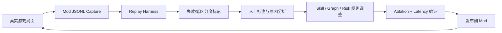

# 产品指标体系与评测闭环

## 指标设计目标

这个项目的推荐质量不能只用“感觉更准”描述。指标体系要同时服务两个目标：

- **AI 应用开发**：证明系统稳定、低延迟、可回放、可回归。
- **AI 产品经理**：证明产品体验有效、失败可见、用户行为能进入迭代闭环。

## 北极星指标

> 真实游戏中，系统能在正确场景、足够低延迟下，给出用户可理解且可复现评测的高质量推荐。

对应可量化表达：

```text
有效推荐率 = 正确场景且有候选项且通过 Critic 校验的推荐次数 / 总推荐触发次数
```

## 指标分层

### 1. 激活指标

| 指标 | 定义 | 数据来源 | 目标 |
| --- | --- | --- | --- |
| API 首次连接成功率 | 启动游戏后 Mod 首次连接 API 成功比例 | Mod diagnostics | 95%+ |
| 首次推荐成功时间 | 从进入首个支持场景到出现推荐的时间 | BridgeEvent | 3 秒内 |
| Mod 加载成功率 | Mod 启动且不导致游戏崩溃的比例 | 本地日志 | 99% |

### 2. 覆盖指标

| 指标 | 定义 | 数据来源 | 目标 |
| --- | --- | --- | --- |
| 支持场景覆盖 | 卡牌、遗物、Boss 遗物、商店、战斗、营火是否可用 | harness + 实机 | P0 全覆盖 |
| 无推荐率 | 支持场景中无 option_scores 的比例 | `/mod/diagnostics` | < 10% |
| 候选项匹配率 | 返回推荐能匹配到游戏内对象的比例 | Mod badge debug | 95%+ |

### 3. 质量指标

| 指标 | 定义 | 数据来源 | 目标 |
| --- | --- | --- | --- |
| Top-1 命中率 | 推荐第一名命中人工标注最佳项 | eval harness | 随 case 增长持续追踪 |
| Top-3 命中率 | 推荐前三包含可接受项 | eval harness | 80%+ |
| 低区分度比例 | Top1 与 Top2 分差过小的 case 比例 | replay analysis | 持续下降 |
| Skip rank | 跳过卡牌在奖励场景中的排名 | replay analysis | 高风险奖励中可合理靠前 |
| Critic warning rate | CriticAgent 输出 warning 的比例 | agent trace | 持续下降 |

### 4. 实时性指标

| 指标 | 定义 | 数据来源 | 目标 |
| --- | --- | --- | --- |
| P50 延迟 | 推荐接口中位延迟 | latency harness | < 100ms |
| P95 延迟 | 推荐接口 95 分位延迟 | latency harness | < 500ms |
| P99 延迟 | 推荐接口 99 分位延迟 | latency harness | < 1s |
| LLM 调用占比 | 实时链路调用 LLM 的比例 | request trace | 0 |

### 5. 可观测性指标

| 指标 | 定义 | 数据来源 | 目标 |
| --- | --- | --- | --- |
| 错误原因可见率 | 失败时 Debug 能显示明确错误的比例 | diagnostics | 95%+ |
| Replay 覆盖率 | 真实失败 case 能 replay 的比例 | JSONL + replay | 90%+ |
| Agent trace 完整率 | 推荐中包含完整 Agent 节点 trace 的比例 | response debug | 95%+ |
| Provenance 覆盖率 | 图谱关系有 source/confidence 的比例 | data audit | 100% |

### 6. 用户行为指标

| 指标 | 定义 | 数据来源 | 用途 |
| --- | --- | --- | --- |
| F8 使用次数 | 显示/隐藏推荐 | Mod event | 判断打扰程度 |
| F9 使用次数 | 查看 Debug | Mod event | 判断失败排查需求 |
| F10 使用次数 | 中英文切换 | Mod event | 判断本地化价值 |
| F11 使用次数 | 目标流派切换 | Mod event | 判断意图控制价值 |
| Hover 详情查看率 | 查看候选项详细解释 | Mod event | 判断解释价值 |
| 推荐采纳率 | 玩家选择 Top 推荐的比例 | Mod event + payload | 判断信任度 |
| 推荐忽略率 | 玩家选择非 Top3 的比例 | Mod event + payload | 发现失败 case |

## Harness 与指标映射

| Harness | 输出 | 对应产品指标 |
| --- | --- | --- |
| Eval Harness | Top-1、Top-3、case pass/fail | 推荐质量 |
| Replay Harness | payload success、option_scores、warnings | 实机稳定性 |
| Ablation Harness | 模块开关对比 | 技术贡献证明 |
| Latency Harness | P50/P95/P99 | 实时体验 |
| Replay Analysis | score gap、score spread、skip rank、quality flags | 推荐区分度 |

## 推荐质量闭环



## 指标看板建议

### 首页摘要

- 今日/本周 payload 数量。
- 支持场景推荐成功率。
- P95 延迟。
- 无推荐率。
- Critic warning rate。
- 低区分度 case 数量。

### 场景分解

- Card reward。
- Relic reward。
- Boss relic。
- Shop。
- Combat。
- Rest site。
- Map，暂时标记为 backend-only。

### 质量分解

- Top-1/Top-3。
- low_top_separation。
- skip_rank。
- unmatched_option_count。
- recommendation_stale_warning。

## 数据事件设计

建议后续 Mod 记录以下事件：

```json
{
  "event_type": "recommendation_rendered",
  "run_id": "local-run-id",
  "timestamp": "2026-06-09T12:00:00Z",
  "scene_type": "card_reward",
  "query_type": "card_pick",
  "selected_skill": "card_pick",
  "target_archetype": "silent_poison",
  "options_count": 4,
  "top_option_id": "catalyst",
  "top_score": 86,
  "latency_ms": 24,
  "critic_warnings": [],
  "language": "zh"
}
```

玩家选择事件：

```json
{
  "event_type": "player_choice",
  "run_id": "local-run-id",
  "scene_type": "card_reward",
  "chosen_option_id": "skip",
  "recommended_top_id": "catalyst",
  "recommended_rank": 4,
  "user_feedback": "bad_recommendation"
}
```

## 隐私与本地化原则

- 默认本地存储，不上传玩家数据。
- Replay payload 去除不必要的个人信息。
- 采集开关默认可控。
- 中英文展示只影响 UI，不影响内部 id。
- 外部社区规则保留 source_url、confidence、source_type。

## 简历量化写法

AI 应用开发：

> 设计 replay/eval/ablation/latency harness，跟踪 Top-1/Top-3、P95 延迟、无推荐率、Critic warning rate 和低区分度比例，将真实 Mod payload 转化为可回归的推荐质量评测。

AI 产品经理：

> 定义 AI 推荐助手指标体系，覆盖激活、覆盖、质量、实时性、可观测性和用户行为，将“推荐是否有用”转化为可度量的产品迭代闭环。

## 下一步

1. 在 Mod 侧增加用户行为事件记录。
2. 将事件输出到 `artifacts/user_feedback/*.jsonl`。
3. 在 `decision_harness.py` 中增加用户选择差异分析。
4. 生成 `reports/product_metrics_report.md`。
5. 把报告摘要加入 README。
