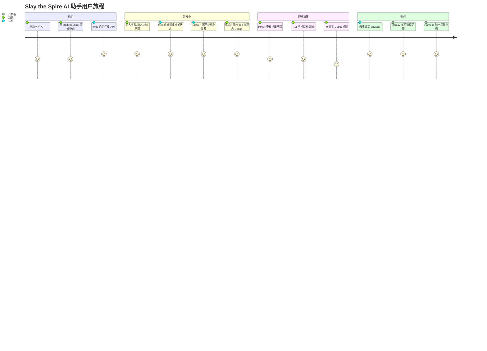

# 用户旅程与核心体验设计

## 目标

本文件描述玩家从启动游戏到查看推荐、理解推荐、反馈推荐的完整体验。它用于证明项目的产品设计不是“把模型接到网页上”，而是围绕真实用户流程重构为游戏内 Mod-first 体验。

## 关键 Persona

### Persona A：进阶玩家

- 已了解基础规则。
- 想提高 A15 到 A20 胜率。
- 经常纠结选牌、Boss 遗物、商店删牌和路线。
- 愿意看解释，但不想频繁切网页。

### Persona B：学习型玩家

- 知道一些流派名称，但不知道什么时候该转向。
- 希望看到为什么某张牌适合或不适合当前卡组。
- 需要中文解释。

### Persona C：AI 应用面试官

- 关注项目是否真实可用。
- 关注 Agent、RAG、评测和低延迟是否只是包装。
- 关注失败案例能否复现。

## 当前用户旅程

## 核心 Happy Path

1. 玩家打开本地 API。
2. 玩家通过 ModTheSpire 启动游戏。
3. Mod 自动连接 API，右上角显示连接状态。
4. 玩家进入卡牌奖励界面。
5. 系统读取候选卡牌、当前职业、卡组、遗物、血量、楼层、目标流派。
6. 后端通过 LangGraph 工作流选择 `CardPickSkill`。
7. RetrievalAgent 检索图谱和流派规则，RiskAgent 识别当前卡组风险。
8. SkillScoringAgent 输出每张牌和 Skip 的分数。
9. CriticAgent 检查推荐是否在当前候选项内。
10. 游戏内每张候选牌旁显示评分 Badge。
11. 玩家 hover 查看为什么推荐和为什么不推荐其他项。
12. 玩家做出选择，进入下一场景。

## 关键场景设计

### 卡牌奖励

用户问题：

- 这张牌强不强？
- 当前卡组需不需要？
- 是否应该跳过？
- 如果我想走毒流/力量流/冰球流，推荐会变吗？

产品响应：

- 每张卡显示 `S/A/B/C` 等级和分数。
- Top 推荐显示主要理由。
- Skip 作为显式候选项参与排名。
- Hover 展示协同、风险覆盖、费用曲线和 why_not。

### Boss 遗物

用户问题：

- 是否需要能量？
- 副作用能不能承受？
- 当前卡组缺抽牌还是缺费用？

产品响应：

- 能量遗物根据费用曲线和抽牌能力加权。
- 副作用遗物根据卡组稳定性、药水、回血、诅咒容忍度调权。
- 解释中突出收益和代价。

### 商店

用户问题：

- 买卡、买遗物、买药水还是删牌？
- 钱够不够？
- 删 Strike/Defend 的价值如何？

产品响应：

- 所有商品包含 price、affordable、item_type。
- 买不起的商品不应排 Top-1。
- 删除卡作为 shop action 参与评分。
- 解释机会成本。

### 战斗

用户问题：

- 当前回合应该先打伤害还是先防御？
- 是否需要用药水？
- 是否能斩杀？

产品响应：

- 输出建议动作顺序。
- 中文模式下卡牌名应显示中文。
- 战斗建议保持浅层规则，未来再做搜索。

### 地图

当前状态：

- 后端保留 PathingSkill 与 fixtures。
- Java Mod 侧 live map capture 曾不稳定，当前产品策略是保守关闭，避免破坏主体验。

产品原则：

- 不稳定功能不要强行放到主流程。
- 后续在 replay 和 fixtures 稳定后再重新上线。

## 异常旅程

### API 未启动

期望：

- 游戏内显示连接失败。
- 不崩溃。
- F9 显示最近错误。

### 推荐为空

期望：

- 面板显示“当前场景无候选项”或“暂不支持该场景”。
- Debug 显示 scene、query_type、options_count。

### 推荐与场景不匹配

期望：

- CriticAgent 产生 warning。
- 不显示旧场景推荐。
- Payload 保存到 replay，后续转成回归测试。

### 中文显示不完整

期望：

- 展示字段优先查 localization。
- 找不到中文时回退英文 id。
- Debug 或 coverage 报告记录缺失翻译。

## 体验原则

- **游戏内优先**：用户不应为了核心推荐切到网页。
- **即时优先**：先显示结构化推荐，复杂解释可以延后。
- **短文本优先**：主面板只显示最关键理由，长解释放 hover。
- **失败可见**：AI 产品不会永远正确，失败原因必须可见。
- **用户意图优先**：目标流派必须进入推荐链路。
- **可回放优先**：每个真实问题都应该能转成 replay case。

## AI 应用开发映射

| 用户体验问题 | 工程解决方案 |
| --- | --- |
| 不想切网页 | Java Mod in-game overlay |
| 推荐慢 | deterministic scoring，不把 LLM 放进实时链路 |
| 推荐错场景 | CriticAgent + scene validation |
| 现场问题难复现 | JSONL capture/replay |
| 推荐不解释 | score_breakdown + why_not + evidence |
| 想按流派推荐 | target_archetype + strategy rules |

## AI 产品经理映射

| 产品问题 | PM 输出 |
| --- | --- |
| 目标用户是谁 | Persona 与核心场景 |
| MVP 做什么 | P0/P1/P2 范围 |
| 为什么做 Mod | 用户旅程痛点 |
| 如何证明有效 | 指标体系和 harness |
| 竞品给了什么启发 | 竞品分析与优先级矩阵 |
| 后续怎么迭代 | Roadmap 与反馈闭环 |

## 下一步体验改进

1. 增加游戏内“推荐有用/无用”反馈。
2. 保存玩家实际选择，与系统推荐做差异分析。
3. 增加典型局面 case study。
4. 对低区分度推荐提示“当前候选接近，请按目标流派选择”。
5. 重新设计地图 lookahead 的采集与回放，再恢复 live 地图推荐。
